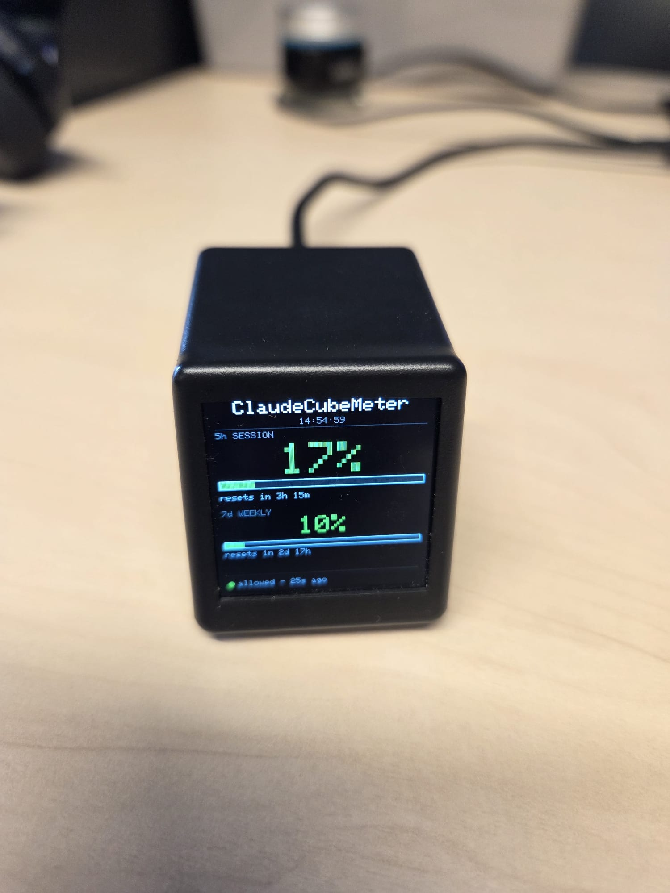
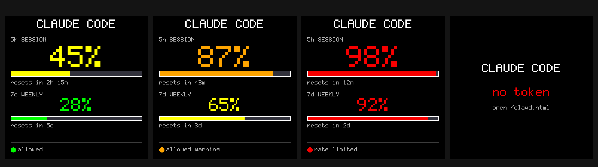

# ClaudeCubeMeter


A desk dashboard that shows your Claude Code rate-limit usage on a tiny LCD
cube. Port of [HermannBjorgvin/Clawdmeter](https://github.com/HermannBjorgvin/Clawdmeter)
(originally an ESP32-S3 + 480×480 AMOLED) to run on top of
[Times-Z/GeekMagic-Open-Firmware](https://github.com/Times-Z/GeekMagic-Open-Firmware)
(ESP8266 + 240×240 ST7789), targeting the **GeekMagic SmallTV-Ultra**.



The GeekMagic SmallTV-Ultra running ClaudeCubeMeter on a desk — 17 % session,
10 % weekly, last proxy push 25 s ago.



Top row, left to right: boot **splash** (5 s), first-run **no_token**, token
set but proxy not pushing yet (**waiting**), Anthropic **error** (HTTP 401 /
expired OAuth). Bottom row: the four data states the device cycles through,
color-coded by usage band (green < 40 %, yellow < 70 %, orange < 90 %, red ≥ 90 %).

## Architecture

ESP8266 has too little heap to do TLS to `api.anthropic.com` (CloudFront does
not negotiate MFLN, so BearSSL needs a full 16 KB RX buffer that won't fit
alongside the web server). To work around this, the device is **passive**:

```
+---------+      poll /v1/messages      +-----------------+
|  Mac /  |  -------- HTTPS ---------►  | api.anthropic   |
|  Linux  |  ◄------- headers --------  +-----------------+
|         |
|  proxy  |     POST /api/v1/clawd/data
|         |  -------- HTTP ----------►  +-----------------+
|         |                             |  ESP8266 + LCD  |
+---------+                             +-----------------+
```

The proxy (`tools/claude_proxy.py`) runs on your computer, polls Anthropic
every 60 seconds, and POSTs the parsed rate-limit values to the device.

## What's different from upstream Clawdmeter

| | Upstream | This port |
|---|---|---|
| MCU | ESP32-S3 | ESP8266 (ESP12) |
| Display | 480×480 AMOLED + touch (LVGL) | 240×240 ST7789 (Arduino_GFX) |
| Transport | BLE GATT, daemon on host | HTTP POST from host-side proxy |
| Buttons | 3 physical (Space, mid, Shift+Tab) | Web UI buttons → webhook helper |
| Animations | 13 pixel-art Clawd loops | Static numeric layout |

Everything else (WiFi config, OTA, bearer-auth REST API, rescue mode, logs)
comes from the GeekMagic base.

## Repository layout

```
firmware/             fork of GeekMagic-Open-Firmware with the clawd/ module
  include/clawd/      ClawdManager.h
  src/clawd/          ClawdManager.cpp (state, render, drawCalibration, etc.)
  data/web/clawd.html web UI for token + shortcut configuration
  data/config.example.json  copy to config.json and fill in WiFi creds
tools/
  claude_proxy.py     Anthropic poller + device push (required for live data)
  webhook_helper.py   optional, translates shortcut POSTs into keystrokes
  render_mockup.py    generates the screenshots in screenshots/
screenshots/          per-state mockups (splash, no_token, waiting, error,
                      normal, warning, limited, live) + mockup_grid.png
```

## First-time setup

### 1. Prepare config

```bash
cp firmware/data/config.example.json firmware/data/config.json
$EDITOR firmware/data/config.json
```

Fill `wifi_ssid`, `wifi_password`, and choose a strong `api_token` (this is
the device's bearer token — protects every REST call). `lcd_rotation: 0` is
correct for SmallTV-Ultra; HelloCubic Lite uses `4`.

### 2. Build & flash

PlatformIO ESP8266 toolchain required. Plug the device in via USB.

```bash
cd firmware
pio run                                          # compile firmware.bin
pio run -t buildfs                               # compile littlefs.bin
pio run -t upload   --upload-port /dev/...       # flash firmware
pio run -t uploadfs --upload-port /dev/...       # flash web UI + config
```

> Some cheap USB-serial adapters can't reliably do the default 921600 baud.
> If uploads time out, change `upload_speed = 115200` in `firmware/platformio.ini`.

The first boot reads `config.json`, migrates WiFi creds + api_token into
encrypted EEPROM storage, then overwrites the JSON. The splash screen shows
the device's DHCP address (held for ~5 s).

### 3. Set the Anthropic token

Open `http://<device-ip>/token.html`, paste the `api_token` you chose, click
Save. Then open `http://<device-ip>/clawd.html` and paste your Anthropic
OAuth access token (the `accessToken` field from `~/.claude/.credentials.json`
on Linux, or the `Claude Code-credentials` macOS Keychain entry).

`sk-ant-oat01-*` Console keys also work and don't expire — but their
rate-limit headers reflect developer-tier limits, not the Claude Code
subscription. OAuth access tokens expire (typically 1–2 days) — refresh
them in the web UI when the screen shows HTTP 401.

### 4. Run the proxy

```bash
python3 tools/claude_proxy.py \
    --device <device-ip> \
    --bearer <api_token from step 1> \
    --auto-token       # reads OAuth token from Keychain/credentials.json
```

Or pass `--token sk-ant-…` explicitly. Default poll interval is 60 s.

To run it persistently on macOS, drop the following LaunchAgent into
`~/Library/LaunchAgents/com.dkoryto.claudecubemeter.plist`:

```xml
<?xml version="1.0" encoding="UTF-8"?>
<!DOCTYPE plist PUBLIC "-//Apple//DTD PLIST 1.0//EN" "http://www.apple.com/DTDs/PropertyList-1.0.dtd">
<plist version="1.0">
<dict>
    <key>Label</key><string>com.dkoryto.claudecubemeter</string>
    <key>ProgramArguments</key>
    <array>
        <string>/usr/bin/python3</string>
        <string>/path/to/claudecubemeter/tools/claude_proxy.py</string>
        <string>--device</string><string>192.168.x.x</string>
        <string>--bearer</string><string>your-api_token</string>
        <string>--auto-token</string>
    </array>
    <key>RunAtLoad</key><true/>
    <key>KeepAlive</key><true/>
</dict>
</plist>
```

Then `launchctl load ~/Library/LaunchAgents/com.dkoryto.claudecubemeter.plist`.

## Shortcut webhook (optional)

Original Clawdmeter has physical buttons acting as a BLE HID keyboard.
ESP8266 has no BLE, so the device exposes `POST /api/v1/clawd/shortcut
{"key":"voice"|"toggle"}` which forwards to a configurable webhook URL.

Run the helper to translate the webhook into real keystrokes:

```bash
python3 tools/webhook_helper.py --port 8765
# in clawd.html set webhook URL to http://<your-mac-ip>:8765/
```

`osascript` (macOS) or `xdotool` (Linux) does the typing.

## REST endpoints added by this port

All require `Authorization: Bearer <api_token>`.

| Method | Path | Body | Purpose |
|---|---|---|---|
| GET    | `/api/v1/clawd/status`    | — | Cached usage state |
| GET    | `/api/v1/clawd/config`    | — | Webhook URL + token preview |
| POST   | `/api/v1/clawd/config`    | `{anthropic_token?, webhook_url?}` | Update fields |
| POST   | `/api/v1/clawd/data`      | `{session_pct, session_reset_min, weekly_pct, weekly_reset_min, status}` | **Proxy push entry point** |
| POST   | `/api/v1/clawd/refresh`   | — | Force direct poll (OOMs on ESP8266; left for ESP32 forks) |
| POST   | `/api/v1/clawd/shortcut`  | `{key}` | Forward to webhook |
| POST   | `/api/v1/clawd/splash`    | — | Redraw the boot splash |
| POST   | `/api/v1/clawd/calibrate` | — | Draw a 240×240 grid for display diagnostics |

## Known limits on ESP8266

- Direct HTTPS to `api.anthropic.com` is **not viable**: CloudFront does not
  negotiate MFLN, BearSSL needs 16 KB RX buffer, free heap during operation
  is ~22 KB. Use the host proxy.
- No splash animations from the original Clawdmeter — pixel-art loops would
  blow flash, especially with OTA + LittleFS overhead.
- Single-threaded — TLS, web server, and display share one core. Don't expect
  realtime UI during long requests.

## License

GPL-3.0 — inherited from upstream Clawdmeter and GeekMagic-Open-Firmware.
See `LICENSE`.
